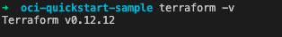
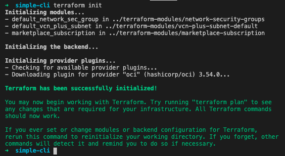
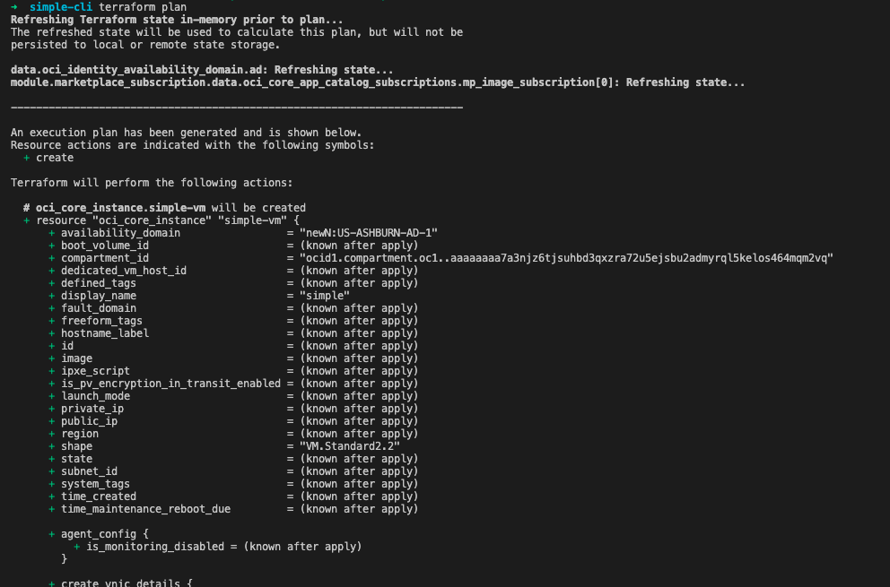
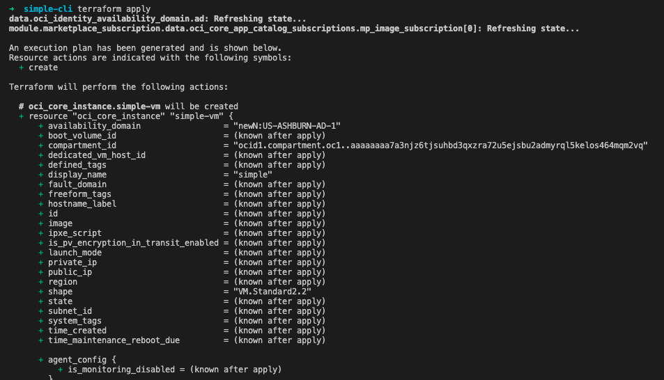
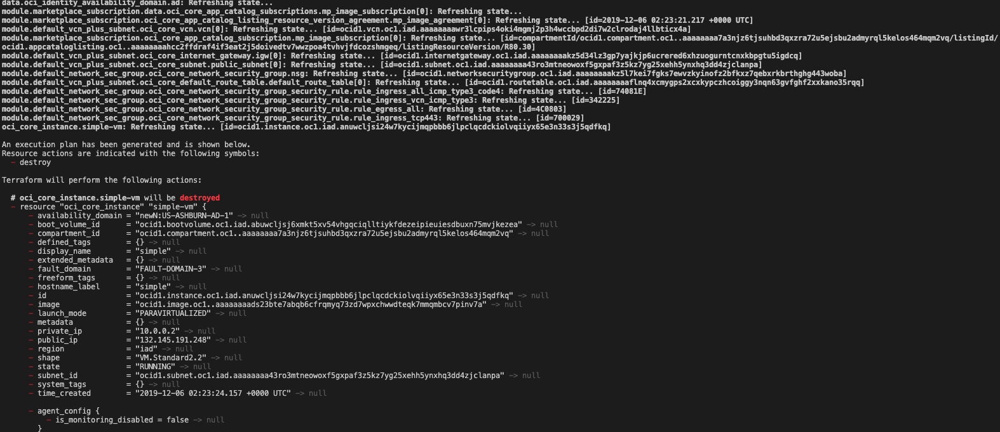
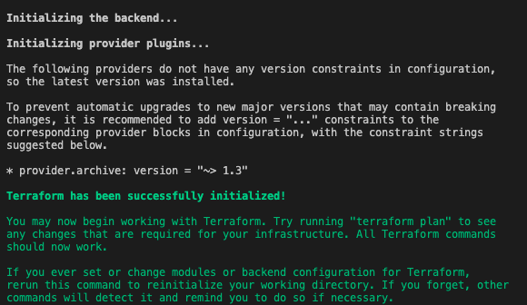
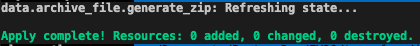
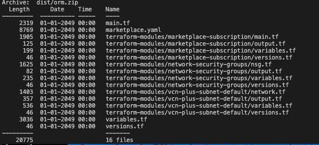
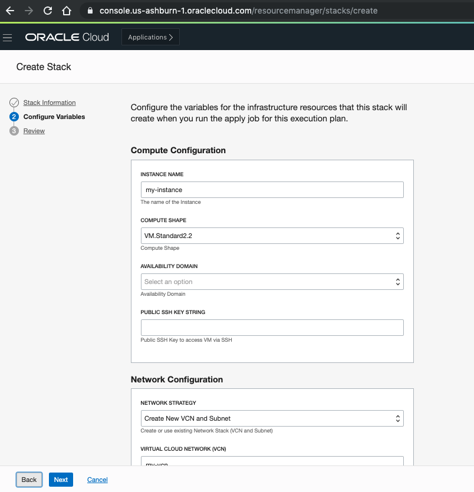

# Check Point R81.20 Security Management with Gaia 3.10 - BYOL

This folder contains all assets for deploying Check Point R81.20 Security Management with Gaia 3.10 - BYOL from Oracle Cloud Infrastructure Marketplace.

There are two options for deployment:
- Create a new network with a public subnet to launch the management into
- Launch the management into an existing network

## How to use Terraform CLI

1. Make sure you have terraform v0.12+ cli installed and accessible from your terminal.

```bash
terraform -v
```



2. You can use the boilerplate available on [terraform.tfvars.template](terraform.tfvars.template) to set up the OCI provider variables or overwrite the variables values defined on [variables.tf](./variables.tf). Rename the file to `terraform.tfvars` so that Terraform CLI can automatically pick it up as the default variables configuration.

You can also define all default values directly on [variables.tf](./variables.tf). However, variables that you want users to specify the value during runtime or you don't want the value persisted on a version control system (as it may contains sensitive data), you can make use of environment variables or typically, terraform.tfvars file.

Note: See the [Inputs](#inputs) section for all the variables description.

3. Initialize your template.

This gives the following output:

```bash
terraform init
```



4. Now you should run a plan to make sure everything looks good:

```bash
terraform plan
```

That gives:


5. Finally, if everything is good, you can go ahead and run `apply`:

```
terraform apply # will prompt to continue
```

The output of `terraform apply` should look like:



6. You now can connect via SSH or HTTPS through the public IP address of the Instance.

7. If you want to destroy the resources previously created. Run `terraform destroy`.


8. Finally, you can modify and extend the existing code based on your needs.

## How to use build-orm

[build-orm](./build-orm) is just a wrapper for packaging terraform CLI into the format supported by OCI Resource Manager. In a nutshell, this template will zip this project and remove some files that are not required by ORM, making it easier to deploy.

1. In order to launch it, make sure you have terraform v0.12+ cli installed and accessible from your terminal.

2. Ensure all variables were specified based on *steps 2 and 3* of the above section - "How to use Terraform CLI".

3. Update [Marketplace schema](./marketplace.yaml) template file that exposes the variables to end users on ORM. More information related to Marketplace schema is available [here](https://github.com/oracle-quickstart/oci-quickstart/blob/master/Marketplace%20Stack%20Schema.md)

4. Initialize your template in [build-orm](./build-orm).

```bash
terraform init
```

This gives the following output:



5. Now, you can go ahead and run `terraform apply`. That will generate check-point-mgmt.zip in the `resource-manager` folder :


You can run `unzip -l resource-manager/check-point-mgmt.zip` and confirm the content of the zip file:



6. Alternatively, you can specify a different path to store the zip file by specifying a variable argument `save_to` during apply: `terraform apply -var="save_to"="path/to/zip"`
 
7. Finally, Create a Stack on OCI Resource Manager, configure all the variables and launch it.


## Inputs
| Name                           | Description                                                                      | Type   | Allowed Values           | Default | Required |
| ------------------------------ | -------------------------------------------------------------------------------- | ------ | ------------------------ | ------- | -------- |
| user_ocid                      | OCID of the user calling the API                                                 | string | "ocid1.user.oc1..."      | N/A     | yes      |
| fingerprint                    | Fingerprint for the public key that was added to this user                       | string |                          | N/A     | yes      |
| private_key_path               | The path to your downloaded private API key file                                 | string |                          | N/A     | yes      |
| tenancy_ocid                   | OCID of your tenancy                                                             | string | "ocid1.tenancy.oc1..."   | N/A     | yes      |
| region                         | An Oracle Cloud Infrastructure region                                            | string | See [Regions](https://docs.oracle.com/en-us/iaas/Content/General/Concepts/regions.htm#top) | N/A | yes |
| compute_compartment_ocid       | Compartment where Compute and Marketplace subscription resources will be created | string | "ocid1.compartment.oc1..." | N/A     | yes      |
| vm_display_name                | Instance name                                                                    | string |                    | "cloudguard-management" | no |
| vm_compute_shape               | The shape of the instance                                                        | string | "VM.Standard2.2" <br/> "VM.Standard2.4" <br/> "VM.Standard2.8" <br/> "VM.Standard2.16" <br/> "VM.Standard2.24" <br/> "VM.Standard.E3.Flex" <br/> "VM.Standard.E4.Flex" <br/> "VM.Optimized3.Flex" <br/> "VM.Standard3.Flex" <br/> "VM.Standard.E5.Flex" <br/> | "VM.Standard2.2" | yes |
| vm_flex_shape_ocpus            | Only for Flex Shapes. The total number of OCPUs available to the instance.       | number |                          | 1       | no       |
| availability_domain_name       | The name of the availability domain                                              | string | Ex: "Uocm:PHX-AD-1"      | N/A     | no       |
| availability_domain_number     | (Required if availability_domain_name is not provided) <br/> OCI Availability Domains: 1,2,3 (subject to region availability) | string | "1" <br/> "2" <br/> "3" <br/> | "1" | yes |
| ssh_public_key                 | Public SSH Key to access VM via SSH. It should start with ssh-rsa.               | string | "ssh-rsa ..."            | N/A     | yes      |
| instance_launch_options_network_type | NIC Attachment Type                                                        | string | "VFIO" or "PARAVIRTUALIZED" | "VFIO" | yes      |
| network_compartment_ocid       | Compartment where Network resources will be created                              | string | "ocid1.compartment.oc1..." | N/A     | yes      |
| network_strategy               | Either create new VCN and Subnet or use existing                                 | string | "Create New VCN and Subnet" or "Use Existing VCN and Subnet" | "Create New VCN and Subnet" | yes |
| vcn_id                         | (Existing VCN) OCID of VCN                                                       | string | "ocid1.vcn.oc1..."       | N/A     | no       | 
| vcn_display_name               | (Create new VCN) Name of VCN                                                     | string |              | "cloudguard-mgmt-vcn" | no |
| vcn_cidr_block                 | (Create new VCN) VCN CIDR                                                        | string |                          | "10.0.0.0/16" | yes |
| vcn_dns_label                  | VCN DNS Label                                                                    | string | Only letters and numbers, starting with a letter. 15 characters max | "management" | no |
| subnet_id                      | (Existing subnet) OCID of existing subnet                                        | string | "ocid1.subnet.oc1..."    | N/A     | no       |
| subnet_display_name            | (Create new subnet) Name of subnet                                               | string |                          | "subnet" | no |
| subnet_cidr_block              | (Create new subnet) Subnet CIDR                                                  | string |                          | "10.0.0.0/24" | yes |
| subnet_dns_label               | (Create new subnet) Subnet DNS Label                                             | string | Only letters and numbers, starting with a letter. 15 characters max | "management" | no |
| nsg_whitelist_ip               | Network Security Groups - Whitelisted CIDR block for ingress communication: Enter 0.0.0.0/0 or <your IP>/32 | string | | "0.0.0.0/0" | yes |
| nsg_display_name               | The name of the Network Security Group                                           | string |               | "management-security-group" | no |
| allow_upload_download          | Automatically download Blade Contracts and other important data. Improve product experience by sending data to Check Point | string | "true" or "false" |  "true" | yes |
| shell                          | Change the admin shell to enable advanced command line configuration             | string | "/etc/cli.sh" <br/> "/bin/bash" <br/> "/bin/csh" <br/> "/bin/tcsh" <br/> | "/etc/cli.sh" | yes |
| admin_password_hash            | GW password hashed using MD5 based BSD password algorithm. Can be generated using 'openssl passwd -1 <my_password>' | string | | N/A | yes |
| maintenance_mode_password_hash | Maintenance mode password hash. Can be generated by running 'grub2-mkpasswd-pbkdf2' | string | "grub..."             | N/A     | yes |
| hostname                       | Name for the shell on the machines                                               | string |                          |         | no       |
| management_gui_client_network  | Allowed GUI clients - GUI clients network CIDR                                   | string |                          | "0.0.0.0/0" | yes |
